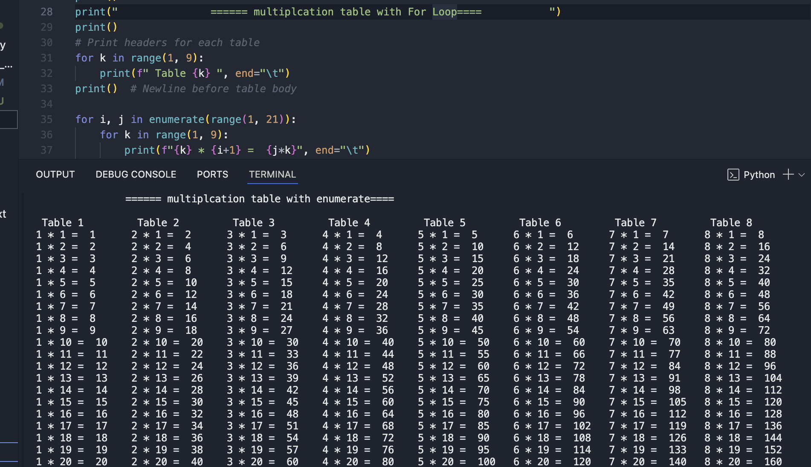

# 🐍 Python Refresher: Essentials & Data Structures

This repository contains code snippets, exercises, and notes from my recent review of Python fundamentals and core data structures using LinkedIn Learning courses.

## Courses Reviewed

### 1. Python Essential Training – _Joe Marini_

- Duration: 3h 41m | Released: Feb 21, 2025
- Focused on:

  - Syntax refresher
  - Functions, modules, and exceptions
  - File I/O, dates & times
  - JSON/XML parsing
  - Object-oriented basics

  ## 🧮 Multiplication Tables (1–8 × 1–20)

This project prints vertical multiplication tables from 1 to 20, for numbers 1 to 8 — all neatly aligned side by side.

### Sample Output

### 2. Python Data Structures – _Kathryn Hodge_

- Duration: 2h 49m | Updated: Dec 6, 2024
- Covered:
  - Lists, tuples, dictionaries, sets
  - Stacks, queues, arrays
  - Performance insights with practical use cases

## Why this Repo?

A quick and 